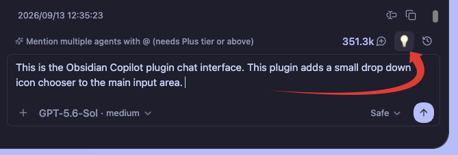
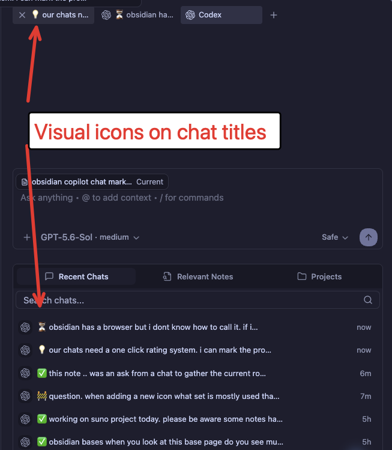

# Chat Marker for Copilot

A small desktop companion plugin for Obsidian Copilot Agent.

Maintained by [SoulBits Vibe](https://github.com/SoulBits-Vibe).

It adds a marker chooser beside Copilot's **Chat History** button. Choosing a
marker:

1. prefixes the active chat title with its icon;
2. keeps the marked title visible in Copilot Chat History; and
3. quietly adds the marker meaning to the next message sent to the agent.

The visible user message and saved Markdown transcript are not modified by the
hidden instruction.

## Screenshots

### Marker chooser

The marker chooser sits beside Copilot's **Chat History** button.



### Marked chat titles

Markers remain visible in open tabs and Copilot's Recent Chats list.



## Default markers

- ⭐ Important
- ❓ Question
- 💡 Idea
- 🚧 In progress
- ⏳ Waiting
- 👀 Review
- ✅ Done

## Customize markers

Markers can be added, renamed, re-iconed, reordered, or removed under
**Settings → Chat Marker for Copilot**. Their agent instructions are editable.

Marker icons are standard Unicode emoji because they also appear in chat
titles. The `✨` shown on a new marker is only a placeholder.

- macOS: press `Control–Command–Space` to open the emoji picker.
- Windows: press `Windows key + .` (period) to open the emoji panel.
- Linux: use the emoji picker provided by the desktop environment or paste an
  emoji into the field.

Obsidian uses Lucide icons for interface controls, but Lucide icon names do not
work in the marker field.

## Compatibility and safety

This plugin does not modify Copilot's installed files. It uses Copilot v4's
live Agent session manager. If that internal interface changes, the plugin
stops title/context integration, leaves chats untouched, and reports the
compatibility problem in its settings. A ribbon button remains available when
Copilot's toolbar markup changes.

Marker state is stored in this plugin's own `data.json`, keyed to the Copilot
backend session. Removing or disabling this plugin does not delete chats.

## Installation

Copy `main.js`, `manifest.json`, and `styles.css` into:

```text
<vault>/.obsidian/plugins/copilot-chat-marker/
```

Then enable **Chat Marker for Copilot** under Community plugins.

## Release files

- `main.js`
- `manifest.json`
- `styles.css`

## Current limitation

Copilot does not expose this integration as a public API. The companion checks
the functions it needs and fails safely, but a future Copilot update may need a
small compatibility adjustment.
